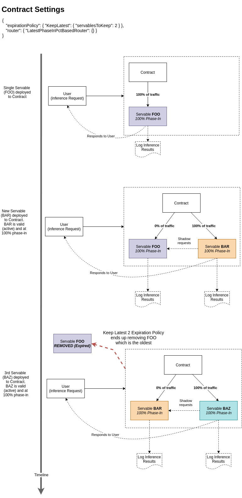

<!--
    Copyright 2019 DreamWorks Animation L.L.C.
    Licensed under the Apache License, Version 2.0 (the "License");
    you may not use this file except in compliance with the License.
    You may obtain a copy of the License at
    http://www.apache.org/licenses/LICENSE-2.0
    Unless required by applicable law or agreed to in writing, software
    distributed under the License is distributed on an "AS IS" BASIS,
    WITHOUT WARRANTIES OR CONDITIONS OF ANY KIND, either express or implied.
    See the License for the specific language governing permissions and
    limitations under the License.
-->


ForestFlow is a scalable policy-based cloud-native machine learning model server. ForestFlow strives to strike a balance between the flexibility it offers data scientists and the adoption of standards while reducing friction between Data Science, Engineering and Operations teams.

ForestFlow is policy-based because we believe automation for Machine Learning/Deep Learning operations is critical to scaling human resources. ForestFlow lends itself well to workflows based on automatic retraining, version control, A/B testing, Canary Model deployments, Shadow testing, automatic time or performance-based model deprecation and time or performance-based model routing in real-time.

Our aim with ForestFlow is to provide data scientists a simple means to deploy models to a production system with minimal friction accelerating the development to production value proposition.

To achieve these goals, ForestFlow looks to address the proliferation of model serving formats and standards for inference API specifications by adopting, what we believe, are currently, or are becoming widely adopted open source frameworks, formats, and API specifications. We do this in a pluggable format such that we can continue to evolve ForestFlow as the industry and space matures and we see a need for additional support.

# Overview

## Model Deployment
For model deployment, ForestFlow supports models described via [MLFLow Model](https://mlflow.org/docs/latest/models.html) format which allows for different flavors i..e, frameworks & storage formats.

ForestFlow also supports a BASIC REST API for model deployment as well that mimics the MLFLow Model format but does not require it.

## Inference
For inference, we’ve adopted a similar approach. ForestFlow standardizes on the [GraphPipe](https://oracle.github.io/graphpipe) [API specification](https://oracle.github.io/graphpipe/#/guide/user-guide/spec) for inference while also providing a basic REST API option as well for maximum flexibility.

Relying on standards, for example using GraphPipe’s specification means immediate availability of client libraries in a variety of languages that already support working with ForestFlow; see [GraphPipe clients](https://oracle.github.io/graphpipe/#/guide/clients/overview).

## Currently Supported model formats (MLFLow flavors)
 - H2O - Mojo Model
 - TensorFlow - Planned
 - PFA - Planned
 - Spark ML Models and Pipelines via [Aardpfark](https://github.com/CODAIT/aardpfark) and PFA - Planned

# Why ForestFlow?
Continuous deployment and lifecycle management of Machine Learning/Deep Learning models is currently widely accepted as a primary bottleneck for gaining value out of ML projects.

We first set out to find a solution to deploy our own models. The model server implementation we found were either proprietary, closed-source solutions or had too many limitations in what we wanted to achieve.
The main concerns for creating ForestFlow can be summarized as:
   - We wanted to reduce friction between our data science, engineering and operations teams
   - We wanted to give data scientists the flexibility to use the tools they wanted (H2O, TensorFlow, Spark export to PFA etc..)
   - We wanted to automate certain lifecycle management aspects of model deployments like automatic performance or time-based routing and retirement of stale models
   - We wanted a model server that allows easy A/B testing, Shadow (listen only) deployments and and Canary deployments. This allows our Data Scientists to experiment with real production data without impacting production and using the same tooling they would when deployment to production. 
   - We wanted something that was easy to deploy and scale for different deployment scenarios (on-prem local data center single instance, cluster of instances, Kubernetes managed, Cloud native etc..)
   - We wanted the ability to treat infer requests as a stream and log predictions as a stream. This allows us to test new models against a stream of older infer requests.
   - We wanted to avoid the "super-hero" data scientist that knows how to dockerize an application, apply the science, build an API and deploy to production. This does not scale well and is difficult to support and maintain.
   - Most of all, we wanted repeatability. We didn't want to re-invent the wheel once we had support for a specific framework. 

While ForestFlow has already delivered tremendous value for us in production, it's still in early phases of development as there are plenty of features we have planned and this continues to evolve at a rapid pace. 
We appreciate and consistently, make use of and, contribute open source projects back to the community. We realize the problems we're facing aren't unique to us so we welcome feedback, ideas and contributions from the community to help develop our roadmap and implementation for ForestFlow.
Check out ForestFlow on Github for a getting started guide and more information. 

# Quick Start
Let's bring up a single-node local instance of ForestFlow

1. Build ForestFlow

    ```bash
    # Create a "local" build
    ./buildah/build-local.sh
    ``` 
1.  Set application environment to local

    ```bash
    export APPLICATION_ENVIRONMENT_CONFIG=local
    ```
1. Define local working directory
    
    This is where ForestFlow will store its state if using default persistence plugin for local install
    
    ```bash
    mkdir -p ./ff-temp
    export LOCAL_WORKING_DIR_CONFIG=./ff-temp
     ```
1. Bring up ForestFlow
   
   This is where ForestFlow will store its state if using default persistence plugin for local install
   See what the version number is defined as in the property `forestflow-latest.version` in [pom.xml](./pom.xml)
   
   Assuming it's 0.2.1, run the following
    
   ```bash
   export FORESTFLOW_VERSION=0.2.1
   ./buildah/run-local.sh
   ```
   This should being up ForestFlow on port `8090`
   If you get any port conflicts feel free to change the ports used for JMX or for ForestFlow by supplying an environment
   variable `APPLICATION_HTTP_PORT_CONFIG` that will override the default 8090 port used.
   
1. Let's verify ForestFlow is running and we can access the API

    ```bash
    curl 127.0.0.1:8090/contracts/list
    ```
    
    You should see something like this:
    ```json
    {
        "Contracts": {
            "contracts": []
        }
    }
    ```
    
    To pretty print from curl, you can pipe to python -m json.tool like so:
    ```bash
    curl 127.0.0.1:8090/contracts/list | python -m json.tool
    ```
    
    You can continue using curl but I prefer using [HTTPie](https://httpie.org/) from the command line as it simplifies making REST API calls.
    
    See [installation](https://httpie.org/#installation) for HTTPie
    
    Using HTTPie
    
    ```bash
     http 127.0.0.1:8090/contracts/list
    ```
     
1. Let's deploy a model to ForestFlow
   
   The git repo comes with a simple H2O model that we can use to test with.
   This sample H2O model uses the [Combined Cycle Power Plant](http://archive.ics.uci.edu/ml/datasets/Combined+Cycle+Power+Plant) dataset and was created
   based on an online H2O tutorial that you can find [here](https://github.com/h2oai/h2o-tutorials/blob/master/h2o-world-2017/automl/Python/automl_regression_powerplant_output.ipynb).
   
   As the tutorial explains, the goal is to predict the energy output given some input features.
   
   Have a look at the servable deployment definition [./tests/basicapi-local-h2o.json](./tests/basicapi-local-h2o.json)
   ```json
    {
      "path": "file://<local path for repo>/tests",
      "fqrv" : {
        "contract" : {
          "organization": "samples",
          "project": "energy_output",
          "contract_number": 0
        },
        "release_version": "StackedEnsemble_AllModels_AutoML_20191002_103122"
      },
      "flavor": {
        "H2OMojo" : {
          "mojoPath": "StackedEnsemble_AllModels_AutoML_20191002_103122.zip",
          "version": "3.22.0.2"
        }
      },
      "servableSettings": {
        "policySettings": {
          "validityPolicy": [
            {
              "ImmediatelyValid": {}
            }
          ],
          "phaseInPolicy": {
            "ImmediatePhaseIn": {}
          }
        },
        "loggingSettings": {
          "logLevel": "FULL",
          "keyFeatures": [
            "reqid"
          ]
        }
      }
    }
    ```
  
   This JSON payload is an example of what a model/servable deployment definition looks like.
   Notice how we specify validity, phase-in, and logging settings for the servable we're about to create.
   
   Let's go ahead and create this Servable in ForestFlow, again, using HTTPie as a command-line HTTP client.
   We need to replace the <local path for repo> in the file with the path for where the file is located.
   We do this using `sed` and passing the result to `httpie`. Alternatively, edit the file and supply the correct path.
   
   ```bash
    export IP=127.0.0.1
    export PORT=8090
    
    # Deploy a model as a Servable to ForestFlow
    echo $(sed 's:<local path for repo>:'`pwd`':' ./tests/basicapi-local-h2o.json) | http POST http://${IP}:${PORT}/servable
   ```
   
   If all goes well, you should see a ForestFlow response indicating the Servable was created successfully.
   ```json
    {
        "ServableCreatedSuccessfully": {
            "fqrv": {
                "contract": {
                    "contractNumber": 0, 
                    "organization": "samples", 
                    "project": "energy_output"
                }, 
                "releaseVersion": "StackedEnsemble_AllModels_AutoML_20191002_103122"
            }
        }
    }
   ```
   
   Now if we inspect the list of Contracts again we see the Servable and Contract we just deployed
   ```bash
   http http://${IP}:${PORT}/contracts/list
   ```
   
   ```json
    {
        "Contracts": {
            "contracts": [
                {
                    "contractNumber": 0, 
                    "organization": "samples", 
                    "project": "energy_output"
                }
            ]
        }
    }
   ```
   
   We didn't explicitly deploy a Contract here as is typically [recommended](#creating-a-contract).
   ForestFlow will automatically setup a Contract with default routing and expiration policy settings if you don't provide one.
   Replying on this behavior is not recommended as it sets you up with ForestFlow defaults which might change in future releases.
   
   It's best to [setup the Contract](#creating-a-contract) first and then deploy the Servable. Nonetheless, we have one setup and we can use it to 
   score against.

   You can also inspect the Servables under a Contract. In this case, we'll see a single Servable deployed
   ```base
    http http://${IP}:${PORT}/samples/energy_output/0/list
   ``` 
   
   ```json
    [
        {
            "FQRV": {
                "contract": {
                    "contractNumber": 0, 
                    "organization": "samples", 
                    "project": "energy_output"
                }, 
                "releaseVersion": "StackedEnsemble_AllModels_AutoML_20191002_103122"
            }
        }
    ]
   ```
   
1. Let's score against the Servable we've deployed

   Let's get some metadata about the Servable we have deployed
   ```base
   http http://${IP}:${PORT}/samples/energy_output/0/StackedEnsemble_AllModels_AutoML_20191002_103122/metadata
   ```
  
    ```json
    {
        "BasicMetaData": {
            "description": "ServableSettings(PolicySettings(List(ImmediatelyValid()),ImmediatePhaseIn()),Some(LoggingSettings(FULL,List(reqid),None)))", 
            "fqrv": {
                "contract": {
                    "contractNumber": 0, 
                    "organization": "samples", 
                    "project": "energy_output"
                }, 
                "releaseVersion": "StackedEnsemble_AllModels_AutoML_20191002_103122"
            }, 
            "inputs": [
                {
                    "description": "[0:TemperatureCelcius,1:ExhaustVacuumHg,2:AmbientPressureMillibar,3:RelativeHumidity]", 
                    "name": "numeric", 
                    "shape": [
                        "4"
                    ], 
                    "type": "Float64"
                }
            ], 
            "name": "prediction", 
            "server": "ForestFlow"
        }
    }
    ```
  
    Notice the Servable takes an input Tensor of type Float64 with 4 fields: TemperatureCelcius, ExhaustVacuumHg, AmbientPressureMillibar, and RelativeHumidity
  
    Scoring against the model represented by the Servable we deployed is fairly simply.    
    Have a look at the contents of [tests/basicapi-score-1.json ](./tests/basicapi-score-1.json)
  
    ```json
    {
      "schema": [
        { "type": "Float64", "fields": ["TemperatureCelcius", "ExhaustVacuumHg", "AmbientPressureMillibar", "RelativeHumidity"] }
      ],
      "datum": [
        {
          "tensors": [
            { "Float64": { "data": [33.2, 60.5, 1010.7, 30]  } }
          ]
        },
        {
          "tensors": [
            { "Float64": { "data": [29.6, 62, 998.5, 40.62]  } }
          ]
        }
      ],
      "configs" : {"reqid":  "123-456-789"}
    }
    ```
    
    We define the schema, essentially telling ForestFlow in what order to expect the provided features
  and then this particular request provides 2 datum records for inference, this is essentially a batch inference requests
  of 2 rows. The first supplies the Float64 tensor with the data points for each field starting with 33.2 for the Temperature in Celcius.
  The 2nd row does the same thing supplying 29.6 for the temp and so and so forth.
   
    Scoring against the model is as simple as passing this as the body to the score API
    ```baseh
    http http://${IP}:${PORT}/samples/energy_output/0/score < tests/basicapi-score-1.json
    ```
  
    ```json
    {
        "Prediction": {
            "datum": [
                {
                    "tensors": [
                        {
                            "Float64": {
                                "data": [
                                    438.18238719825354
                                ]
                            }
                        }
                    ]
                }, 
                {
                    "tensors": [
                        {
                            "Float64": {
                                "data": [
                                    437.5805895467613
                                ]
                            }
                        }
                    ]
                }
            ], 
            "fqrv": {
                "contract": {
                    "contractNumber": 0, 
                    "organization": "samples", 
                    "project": "energy_output"
                }, 
                "releaseVersion": "StackedEnsemble_AllModels_AutoML_20191002_103122"
            }, 
            "schema": [
                {
                    "fields": [
                        "Regression"
                    ], 
                    "type": "Float64"
                }
            ]
        }
    }
    ```
   
    ForestFlow returns a prediction for each row in addition to the FQRV of the Servable that responded with this prediction.
  
    ForstFlow allows for multiple Servables to be deployed under the same Contract and for a routing strategy to determine which
  Servable responds to user requests and if the remaining Servables shadow the inference request for logging and performance 
  monitoring purposes. See the section on [Creating a Contract](#creating-a-contract) and routing for more details. 

1. We can also inspect some stats ForestFlow collects about the use of Servables within a Contract
    ```baseh
    http http://${IP}:${PORT}/samples/energy_output/0/stats
    ```
  
    ```json
    [
        {
            "ServableMetrics": {
                "becameValidAtMS": "1570054677902", 
                "createdAtMS": "1570054677899", 
                "currentPhaseInPct": 100, 
                "fqrv": {
                    "contract": {
                        "contractNumber": 0, 
                        "organization": "samples", 
                        "project": "energy_output"
                    }, 
                    "releaseVersion": "StackedEnsemble_AllModels_AutoML_20191002_103122"
                }, 
                "scoreCount": "1", 
                "shadeCount": "0"
            }
        }
    ]
    ```

Finally, you can also build and run ForestFlow in a container (docker, podman) and we provide scripts to help with this process.
See [Creating an OCI-compliant Image](#creating-an-oci-compliant-image)

# Getting started
We provide scripts to build ForestFlow for use in local, or custom distributed clusters, or specifically for [Kubernetes](https://kubernetes.io/).
The result of a build is a JAR with all dependencies included. We also provide [Buildah](https://buildah.io/) [scripts](./buildah/buildah.sh) for building OCI-compatible images that you can run
using container engines such as [podman](https://podman.io/) and [docker](https://www.docker.com/) etc..

<a name="build-requirements">Build requirements:</a>
 - Java 11 (tested with [openjdk](https://openjdk.java.net/))
 - [Maven](https://www.apache.org/)
 
<a name="image-build-requirements">Container (OCI) image build requirements:</a>
 - [Buildah](https://buildah.io/) 
 - [Podman](https://podman.io/)

#### Building ForestFlow
Have a look at [Build Requirements](#build-requirements) for essential build dependencies.

###### Create JAR without Kubernetes dependencies

```bash
./buildah/.build-local.sh
``` 

###### Create a JAR with Kubernetes dependencies
This will include Kubernetes-specific dependencies for cluster discovery
```bash
./buildah/.build-kubernetes.sh
``` 

There is no harm in using the Kubernetes-specific build locally however note that your JAR file will have more
dependencies and is subsequently larger in size.

#### ForestFlow Configuration

Controlling what ForestFlow does and how it looks for nodes to join as a cluster, or simply come up with a single local
instance is all based on configuration properties defined in [application.conf](./serving/src/main/resources/application.conf)

ForestFlow uses [Lightbend Config](https://github.com/lightbend/config), formerly known as Typesafe Config, for all its configuration properties.
The configuration defined in the [application.conf](./serving/src/main/resources/application.conf) controls how 
ForestFlow clustering works (custom/local vs K8s), where it persists data, and where ([Kafka cluster](https://kafka.apache.org/)) predictions are logged. 


The configuration has 3 main sections (defaults, local, and K8s). ForestFlow will always load configuration values from the defaults section.
ForstFlow will conditionally load the `local` configs or `K8s` based on the value of the environment variable `APPLICATION_ENVIRONMENT_CONFIG`

Example: ```APPLICATION_ENVIRONMENT_CONFIG=local``` will load local configs.

Description of configuration sections:
 - defaults:
 
    Always loaded.
    
    This provides necessary defaults for most ForestFlow configurations.
    Some of these can be changed based on your use case. Others are necessary and cannot be removed or changed.
    We recommend only adjusting these after you're comfortable running and operating ForestFlow and AKKA Clusters.
    We provide sensible defaults for most parameters.
    We also provide environment variable overrides for the parameters that are meant to be user-configurable. 
    
 - local
 
    Conditionally loaded if  ```APPLICATION_ENVIRONMENT_CONFIG=local```
    
    This is meant to simplify a local ForestFlow instance or a custom deployment without much opinion around discovery.
    You can just as easily bring up a single node on a single machine or multiple nodes on a single host or across multiple
    servers. The options are fairly open. Local does take some assumption about where data is persisted that you'll have
    to override for production deployments in this mode. The K8s section provides an example using the `jdbc-journal` and 
    `jdbc-snapshot-store` plugins for persistence. This is a good approach.  If using JDBC for persistence, the JDBC 
    properties are defined in `defaults.slick` in the application.conf.
                       
    
 - K8s
 
    Conditionally loaded if  ```APPLICATION_ENVIRONMENT_CONFIG=K8s```
        
    This section is custom-tailored for a Kubernetes-based deployment. Note that you must have built the JAR using the 
    K8s maven profile (or via the build-kubernetes.sh script which does exactly that to get the necessary dependencies for
    Kubernetes API-based node discovery for cluster deployments.
    
    This also assumes a JDBC-based persistence model for preserving cluster state. The JDBC properties are defined in `defaults.slick`
    in the application.conf.

You have a lot of control over how you want to run ForestFlow but we provide a few defaults:
 - Logging
 
   ForestFlow uses Kafka for prediction logging. To use this, you must supply the following environment variables
   so ForestFlow knows where to log [Prediction](./core/src/main/protobuf/Prediction.proto) messages to:
   
    - KAFKA_BOOTSTRAP_SERVERS_CONFIG
    
      List of Kafka brokers
      
    - KAFKA_PREDICTION_LOGGER_BASIC_TOPIC_CONFIG
    
      Kafka topic to use when logging BASIC REST API-based inference requests and responses.
      
    - KAFKA_PREDICTION_LOGGER_GRAPHPIPE_TOPIC_CONFIG
      
      Kafka topic to use when logging GraphPipe-based inference requests and responses.
    
 - Persistence
 
    Any AKKA persistene plugin can be used. 
    
    For local, ```APPLICATION_ENVIRONMENT_CONFIG=local```, installs we default to a local leveldb using `akka.persistence.journal.leveldb`
    This is good for quick tests but doesn't really offer any cluster-external persistence storage guarantees.
    We recommend overriding this by supplying values for the environment variables controlling `journal` and `snapshot` persistence.
 
     Exxample: 
     
     ```
     AKKA_PERSISTENCE_JOURNAL_PLUGIN=jdbc-journal
     AKKA_PERSISTENCE_SNAPSHOT_STORE_PLUGIN=jdbc-snapshot-store
     ```
 
    This is the default for K8s, ```APPLICATION_ENVIRONMENT_CONFIG=K8s```
    
    The specifics of which database to connect to and how is defined in `defaults.slick` in application.conf
     
 
  - Clustering
  
    You can run ForestFlow as a single instance, or scale it horizontally across multiple nodes. To form a Cluster of nodes
    , nodes have to be able to "find", aka. discover, each other. This can be done in a myriad of different ways; most common
    being DNS, Kubernetes API, Consul, or a simple list of IPs.
     
    ForestFlow uses Lightbend's Akka Cluster Bootstrap libraries to offer the most flexibility and battle tested APIs.
    As of this writing, Lightbend's Akka Discovery supports Simple IP list, DNS, Kubernetes, Consul, Marathon, and AWS.
     
    See [here](https://doc.akka.io/docs/akka-management/current/discovery/index.html) for more details.
    
    ForestFlow defaults to `local-cluster` when the application environment is set to `local` and defaults to `kubernetes-api` 
    when the application environment is set to `K8s` while providing sensible configuration defaults for each.
    
    This means you can easily bring up a local, single-node, instance of ForestFlow with very little configuration changes, if any.
    
  - Clustering Split-Brain Resolver
  
    For distributed systems, network partitions are a way of life and must be handled appropriately. Lightbend 
    [describe this problem eloquently](https://doc.akka.io/docs/akka-enhancements/current/split-brain-resolver.html#the-problem).
    
    Lightbend also provides a commercial implementations for a Split-Brain resolver however in an effort to keep this as open as possible,
    ForestFlow uses an Open Source Split-Brain Resolver called [simple-akka-downing](https://github.com/arnohaase/simple-akka-downing)
    
    We again provide sensible defaults in the `defaults` section of the application.conf file but feel free to customize based on your
    needs. Some examples for customization could be changing the strategy to "static-quorum" or "keep-majority". See 
    [simple-akka-downing](https://github.com/arnohaase/simple-akka-downing) for more details on customizing this and 
    Lightbend's [Split Brain Resolver](https://doc.akka.io/docs/akka-enhancements/current/split-brain-resolver.html#akka-split-brain-resolver) documentation.


#### Creating an OCI-compliant Image
You can build and run ForestFlow in a container (docker, podman) and we provide scripts to help with this process.
See [Image Build Requirements](#image-build-requirement) for details on requirements for building a ForestFlow image.
We may supply a standard image in a container registry like docker.io at some point in the future. 
 
ForestFlow comes bundled with a [Buildah](./buildah/buildah.sh) script that assumes a successful build is available in 
the target directory of the serving module. Using either the [build-local.sh](./buildah/build-local.sh) or 
[build-kubernetes.sh](./buildah/build-kubernetes.sh) scripts will provide just that. 

```bash
# Create a "local" build
./buildah/build-local.sh

# Compile into an OCI-compliant image using Buildah
./buildah/buildah.sh

# Use podman (or docker) to run ForestFlow in a container locally
podman_container=$(podman run -d \
-e "APPLICATION_ENVIRONMENT_CONFIG=local" \
--net=host \
--name=ff-serving localhost/com.dreamworks.forestflow-serving:0.2.1)

podman logs -f ${podman_container}
```

See [./buildah/run-local-container.sh](./buildah/run-local-container.sh) for another example of using Podman (similar to docker) and 
supplying some overrides for Persistence and Kafka logging.

# Inference
ForestFlow currently exposes 2 APIs for inference; namely the BASIC REST API and the GraphPipe API. Both APIs support a similar set of features.
Servable type implementations in ForestFlow (model types), as in H2O or TensorFlow, have the option to support the BASIC REST API, the GraphPipe API or both.
This is a server implementation detail for each servable and it's meant to offer flexibility for onboarding servable types quickly that may not adhere to every interface ForestFlow supports.
This also keeps ForestFlow's API flexible enough to incrementally adapt more interfaces in the future.  

###### Servable implementation interface support matrix:

| Servable Type |  BASIC REST API  |  GraphPipe API  |
|---|---|---|
| H2O  | YES  | YES  |
 

## Inference - Using the BASIC REST API
The BASIC REST API relies on ProtoBuf definitions but exposes a JSON interface for ease of use.
The proto schema is defined in [InferenceRequest.proto](./core/src/main/protobuf/InferenceRequest.proto)

A BASIC REST API Inference Request takes:
  - A Tensor Schema which maps Tensors and their types to a list of field names
  - An Array of [Datums](./core/src/main/protobuf/Tensor.proto) which in turn is an Array of Tensors
  - The Tensors themselves carrying features. A Tensor per data type.
  - A map<string, string> of configs. Configs can be used to supply data used when logging model predictions or to supply additional configuration parameters to Servables for inference requests.
    The keys in the config map are matched on with logging settings keys for logging predictions.
  
Each element in the Datum array represents an inference request record with a full feature set for an inference request.
A Datum with multiple array elements represents a batch prediction for multiple records. Every Datum record represents an inference request.
This is how the BASIC API allows for batch inference requests for optimized client-server round-trip performance.
Note that routing to different models is done at the entire batch level. So the entire array of Datums is sent to a single model for inference.
This is a  tradeoff the user has to make when between # of inference requests in a single batch vs routing requirements.
For example if you had 3 models competing for inference requests, all the records in a single inference request (i.e., all the elements in the Datum array) will route to a single model.
Subsequent inference requests, and their associated Datum record(s) will route to a model based on the routing criteria and phase-in percentages.
This isn't something to ponder too much about. Simply be aware of it in case your use case requires different behavior.

Here's a contrived inference request example on a gaming dataset 
```json
{
  "schema": [
    { "type": "String", "fields": ["name", "category"] },
    { "type": "Float64",  "fields": ["hp", "attack", "defence"] }
  ],
  "datum": [
    {
      "tensors": [
        { "String": { "data": ["human1", "human"]  } },
        { "Float64": { "data": [67.37, 25.2, 80.6]  } }
      ]
    },
    {
      "tensors": [
        { "String": { "data": ["mon16", "monster"]  } },
        { "Float64": { "data": [76.5, 62, 33.9]  } }
      ]
    }
  ],
  "configs" : {"gameid":  "some-uuid", "playerid":  "player-uuid"}
}
```

Notice how this example defines a schema of 2 tensors because the features the inference request for the model where this is used has both String and Float64 features.
The schema further identifies the positional field names for each supplied feature column. For example in the first datum, human1 represents the `name` field. Similarly 80.6 represents the value for the `defence` field.
Also notice that this is a batch inference request since there are 2 datums provided, each with its full list of features matching the schema provided.
There's no fundamental difference in structure with a a single inference request vs a batch request. A single inference request is just a batch request with 1 datum record.

######Performance considerations for batch size
While larger inference batches are generally a good thing, if applicable, depending on how ForstFlow is configured and deployed, 
the number of batch records in each request may introduce some undesirable performance or latency implications.
For example, in shadow mode, where a model is simply shadowing the execution of inference requests and logging results, these models will pickup shadow requests when there are no pending
high priority user-facing inference requests in their queue. However if the model is then busy with a very large batch shadow mode inference request and it is then required to serve a high priority user-facing
inference request, it does not stop processing the in-hand shadow request. i.e., it doesn't preempt its work. The high-priority inference request waits until the next available slot is available.
This can be avoided by balancing the size of batches in addition to deployment considerations. Planned versions of ForestFlow will add more flexibility here and bring in the concept of model replicas that can balance and distribute work.  

## Inference - Using the GraphPipe API


# Basic Concepts
## A ForestFlow Cluster

#### Servable
The smallest deployable entity in ForestFlow is called a `Servable`. This closely follows nomenclature used in TensorFlow Serving.
A Servable represents an instance of a model loaded into memory for serving inference requests. Deploying a model means creating a Servable.
Each Servable is uniquely identified by its Fully Qualified Release Version or `FQRV` for short. 

#### Fully Qualified Release Version (FQRV)
The FQRV is one of the most important concepts within ForestFlow because routing and scoring (inference) is based on the FQRV.

The [FQRV](./core/src/main/protobuf/FQRV.proto) consists of a `contract: Contract` and `release_version: String`.

###### Release Version
The `release_version` along with the Contract **MUST** uniquely identify a deployed Servable/Model.
The release version is used to distinguish between Servables with the same features that serve the same use case.
The release version has no requirements for format; it's a simple string however a good candidate might be the date a model was trained and the type of model deployed.
This is how ForestFlow allows for multiple versions of a model to co-exist and serve the same use case.

The ability to produce and simultaneously deploy multiple versions of a model for the same use case allows for
 - Canary deployments: Gradual onboarding of new releases
 - Shadow mode: Deploying models that only listen to inference requests and log their results without contributing to user responses. i.e., models that shadow production work for test and validation.
   This can be used for example to implement a Blue-Green release process.
 - Performance-based routing: Multiple models deployed for the same use case and routing to the model that shows best performance (based on performance metric feedback sent to ForestFlow)
 - Trigger-based onboarding: Routing to deployed models only when a certain criteria is established. A good example for this would be to deploy newer/retrained versions of a model in shadow mode only and use an external approval process to Trigger activation like a Jira ticket approval.
 - Time-based onboarding: Similar to Canary deployments except the onboarding and percentage of traffic a new release gets is automated and time driven.

In addition to deployment (Validity and Phase-In policies) a Contract, details below, defines expiration policies for the group of Servables defined within it.

This approach allows the user to define a myriad of scenarios. A few examples include:

 - Keep Top-K performers: Use a performance-based router and only keep the Top K performing Servables.
   Automatically expire servables that fall out of the range.
   All others still compete for traffic based on a defined performance metric.
 - Route to latest deployed Servable and keep previous K Servables around for shadow mode only.
   This allows for quick rollback to Servables still in Shadow mode in case something unexpected happens with the latest deployment.
 
###### Contract
A [Contract](./core/src/main/protobuf/Contract.proto) is a struct of 3 elements:
 - <a name="contract-organization"></a>organization: String. Top-level organization or namespace the servable belongs to. This of this as your team's name, company, or department name. 
 - <a name="contract-project"></a>project: String. The project under the organization the servable addresses. Think of this as the specific use case this servable addresses.
 - <a name="contract-contract_number"></a>contract_number: Int32. The contract is meant to be used to group multiple model releases. Inference requests are at the contract level.
 Different model versions can be deployed to a single Contract and compete for traffic in some way. An inference request always addresses a Contract number within an Organization and Project.
 The defined Routing, Validity and Phase-In policies determine which specific Servable ends up processing an inference request.
 This is essentially where all the routing happens between Servable releases. For example, you could have 2 models deployed with    

The relationship between Contract to Servable is 1-to-Many. A Contract can have many Servables.
The identifier of each Servable within a Contract is the aforementioned [release version](#release-version).
So there's a parent-child relationship between Contracts and Servables. The relationship is defined by the values of the FQRV.

Example of 2 Servables under the same Contract

FQRV for a Servable named "h2o_regression_**v1**":
```json
"fqrv" : {
    "contract" : {
      "organization": "DreamWorks",
      "project": "schedule",
      "contract_number": 0
    },
    "release_version": "h2o_regression_v1"
  }
```

FQRV for a Servable named "h2o_regression_**v2**":
```json
"fqrv" : {
    "contract" : {
      "organization": "DreamWorks",
      "project": "schedule",
      "contract_number": 0
    },
    "release_version": "h2o_regression_v2"
  }
```

These 2 Servables share the same Contract defined by the organization, project and contract_number.

When we define a router and expiration policy for the Contract. The Contract then uses these settings to understand how it needs to route requests between the deployed Servables
within it. Similarly the expiration policy on the Contract applies to these 2 servables.  

###### FQRV Extraction
The FQRV is defined at the time of model deployment.
ForstFlow has support for automatic FQRV extraction for some protocols when fetching a model.
Git would be a good example. FQRV extraction is supported if a certain tagging convention is used otherwise an FQRV with the Serve deployment request is required. 
See Servable (Model) Deployment for more details.

## Servable (Model) Deployment
Deploying a model and creating a Servable in ForestFlow is a simple REST API call with parameters to configure policies for the Contract and Servable.
If this is a new use case/Contract, the general recommendation is to first define and create the [Contract](./core/src/main/protobuf/Contract.proto) and [Contract Settings](./core/src/main/protobuf/ContractSettings.proto) for the use case the Servable is meant to be deployed to.

#### Creating a Contract
Recall that a Contract consists of potentially more than one Servable. The Contract Settings determine how a Contract routes traffic between its underlying Servables in 
addition to when it considers a Servable expired (expiration policy) and removes it.

 - API Endpoint: /[organization](#contract-organization)/[project](#contract-project)/[contract_number](#contract-contract_number)
 - REST Verb: POST for new Contracts. PUT for updating existing Contracts
 - Payload: JSON, as [Contract Settings](./core/src/main/protobuf/ContractSettings.proto)

The payload is a JSON that represents Contract Settings which defines an expiration policy and router.
The `Expiration Policy` governs how and when Servables are marked as expired and removed from ForestFlow and the Contract.
The `Router` controls how traffic is distributed across different Servables, if any, within a Contract.

Example:

```http request
POST https://forestflow.com/DreamWorks/schedule/1
```
```json
{
  "expirationPolicy": {
    "KeepLatest": {
      "servablesToKeep": 2
    }
  },
  "router": {
    "LatestPhaseInPctBasedRouter": {}
  }
}
```

In this example we define a new Contract with Organization = DreamWorks, Project = schedule, Contract Number = 1
This Contract has a Keep Latest expiration policy set to keep the 2 most recently active Servables.
Anything beyond that is expired and removed. Additionally the Contract sets up the Router such that traffic only goes to
the most recently active Servable assuming it's been fully phased-in based on the Servable's own Phase-In policy.

The effect of this setup is that once a Servable is fully phased-in and made active (active state is based on the Servable's Validity Policy)
it will completely take over the previous Servable's inference requests however because the expiration policy keeps the last 2 active Servables,
the previous Servable, prior to the now most recent one, will remain active in Shadow Mode, essentially replicating the work and logging its results but 
not responding directly to user inference requests.

The following diagram illustrates this scenario with 2 Servables (FOO, and BAR) under the same Contract.




Currently available [Expiration Policy](./core/src/main/protobuf/ExpirationPolicies.proto) implementations are:
 - [KeepLatest](./core/src/main/scala/com/dreamworks/forestflow/serving/impl/ExpirationPolicies.scala)
 
   Keeps a supplied number of valid (active) Servables based on date Servable became active. Keeps most recently active.
   
 - [KeepTopRanked](./core/src/main/scala/com/dreamworks/forestflow/serving/impl/ExpirationPolicies.scala)
 
   Keeps a supplied number of Servables based on a performance metric. 
 
 
Currently available [Router](./core/src/main/protobuf/ContractRouters.proto) implementations are:
 - [FairPhaseInPctBasedRouter](./core/src/main/scala/com/dreamworks/forestflow/serving/impl/ContractRouters/FairPhaseInPctBasedRouter.scala)
   
   Equally distributes traffic between valid (active) Servables based on their Phase In Percent.
   
 - [LatestPhaseInPctBasedRouter](./core/src/main/scala/com/dreamworks/forestflow/serving/impl/ContractRouters/LatestPhaseInPctBasedRouter.scala)
   
   Routes 100% of traffic to the latest (last to become valid) servable.
   If latest servable is not at 100% phase in, this acts a lot like a FairPhaseInPctBasedRouter against the latest 2
   servables, i..e, the latest servable and the one prior to that will share traffic based on their respective Phase In %
   until the latest (last to become valid) Phase In % hits 100% which will then trigger the router to send 100% traffic to latest servable.
   
 
#### Creating a Servable
After [setting up a Contract](#creating-a-contract), deploying a model and creating a Servable is a simple REST call.
The REST call can either reference where the MLmodel yaml file is if using [MLFlow](https://mlflow.org)
In ForestFlow this is referred to as the [MLFlowServeRequest](./core/src/main/protobuf/MLFlowServeRequest.proto).

OR

Simply provide all necessary information as part of the request itself as defined here.
In ForestFlow this is referred to as the [BasicServeRequest](./core/src/main/protobuf/BasicServeRequest.proto). We start off with the BasicServeRequest and then expand on how the MLFlowServeRequest differs.

 - BasicServeRequest
 
   Let's start with an example and then breakdown the various components
 
     ```json
     {
       "path": "file:///my-models/DreamWorks/schedule/0",
       "flavor": {
        "H2OMojo" : {
          "mojoPath": "myRegressionModel_2.0.zip",
          "version": "3.22.0.2"
        }
       },
       "fqrv" : {
         "contract" : {
           "organization": "dreamworks",
           "project": "HTTYD",
           "contract_number": 3
         },
         "release_version": "2.0"
       },
       "servableSettings": {
         "policySettings": {
           "validityPolicy": [
             {
               "ImmediatelyValid": {}
             }
           ],
           "phaseInPolicy": {
             "ImmediatePhaseIn": {}
           }
         },
         "loggingSettings": {
           "logLevel": "FULL",
           "keyFeatures": [
             "someKey",
             "anotherKey"
           ]
         }
       }
     }
     ``` 
 
   - <a name="serve-request-path">**path**</a>: Where is the model artifact stored (excluding the model file name). ForestFlow must be able to access this file path.
     Example:
     Local filesystem: file:///my-models/DreamWorks/schedule/0
     Git: git@github.com:<USER or Org>/<project>.git#v<Numeric Contract Number>.<Release Version>
     
     ForestFlow currently supports the following [StorageProtocols](./core/src/main/scala/com/dreamworks/forestflow/utils/SourceStorageProtocols.scala):
      - local file system
      - git (with support for Git LFS)
      
     ForestFlow is pluggable and there are plans to add support for other protocols
     such as HDFS, S3, HTTP and FTP in the future.
     
   - **artifact_path** (optional): An optional string that further defines the root of the model artifact itself.
     
     In the local filesystem example used above for `path`, we could have set the path to "file:///my-models/DreamWorks" and then further 
     detailed that the artifact_path is "schedule/0".
     
     _Usage:_
     
     For the BASIC REST API, this is more for organizational and future proofing, in addition to closely mimicing the MLModel-based API.
     The real benefit in having an artifact_path is when using the MLModel-based API. You may chose to version control your `MLmodel` yaml files
     in Git but then have your artifacts stored in S3 for example. This allows you to do exactly that. The [path](#serve-request-path) defines 
     where the MLmodel file can be found and the artifact_path in the MLmodel file then describes the root path and protocol of where the artifacts
     can be found which can be something else entirely.

     
   - **[fqrv](./core/src/main/protobuf/FQRV.proto)**: Required if the path doesn't support FQRV extraction and the path provided doesn't follow an extraction pattern.
   
     Currently Git is the only protocol that supports FQRV extraction.
      - Git User/Org maps to fqrv.contract.organization
      - Git project maps to fqrv.contract.project
      - Git Tag format **MUST** follow v<Numeric Contract Number>.<Release Version? format. Example Git tag: v0.h2o_regression_v2
        
        The tag segments map to fqrv.contract.contract_number and fqrv.release_version respectively.
        
        If the Git path supplied does not match this format then an FQRV JSON is required.
        
        An FQRV can always be provided even if a path supports FQRV extraction. The explicitly provided FQRV takes precedence.

   - **[flavor](./core/src/main/protobuf/Flavors.proto)**: The Servable flavor and flavor properties
    
      ForestFlow currently supports:
       - H2O Flavor: The H2O flavor only works with the mojo export format. The H2O flavor has the following format:
       
       ```json
        "flavor": {
            "H2OMojo" : {
              "mojoPath": "mojofilename.zip",
              "version": "3.22.0.2"
            }
          }
       ```
       
       mojoPath: The H2O MOJO file name
       
       version: The H2O version used to generate the MOJO file. This is intended for future compatibility requirements.
       
   - **[servableSettings](./core/src/main/protobuf/ServableSettings.proto)**: Define a validity and phase in policy.
   
      - **[validityPolicy](./core/src/main/protobuf/ValidityRules.proto)**: Tells ForestFlow when to consider this Servable valid (active).
      A Servable is only ever considered for inference requests if it's deemed "active". 
      
        Currently Supported [Validity Policies](./core/src/main/protobuf/ValidityRules.proto):
         - [ImmediatelyValid](./core/src/main/scala/com/dreamworks/forestflow/serving/impl/ValidityRules.scala)
         - [NeverValid](./core/src/main/scala/com/dreamworks/forestflow/serving/impl/ValidityRules.scala)
         - [TimeBasedValidity](./core/src/main/scala/com/dreamworks/forestflow/serving/impl/ValidityRules.scala)
         - [PerformanceBasedValidity](./core/src/main/scala/com/dreamworks/forestflow/serving/impl/ValidityRules.scala)
         - [MinServedEventsBasedValidity](./core/src/main/scala/com/dreamworks/forestflow/serving/impl/ValidityRules.scala)
       
      - **[phaseInPolicy](./core/src/main/protobuf/PhaseInPolicies.proto)**: Tells ForestFlow how to phase-in this Servable, i.e., how to appropriate traffic to this Servable after it becomes valid.
        
        Currently Supported  [Phase In Policies](./core/src/main/protobuf/PhaseInPolicies.proto): 
         - [ImmediatePhaseIn](./core/src/main/scala/com/dreamworks/forestflow/serving/impl/PhaseInPolicies.scala)
         - [LinearTimeBasedPhaseIn](./core/src/main/scala/com/dreamworks/forestflow/serving/impl/PhaseInPolicies.scala)
         
     - **[loggingSettings](./core/src/main/protobuf/LoggingSettings.proto)**: Define when and how a Servable "logs" prediction events which are the result of an inference request.
     
       Logging Settings takes 3 parameters
        - logLevel (defaults to NONE): `NONE`, `FULL`, or `SAMPLE`
        - keyFeatures `array[string]`: Optional list of strings that tell ForestFlow which config values from an inference request to pull in as the key for the logged prediction record.
          If an inference request provides configs in the config map, the logged Prediction record will attempt to locate the list of keys defined here in the config map and 
          uses the matching key values from the config map to formulate a new "Key" for the Prediction record.
          The default [Prediction Logger](./event-subscribers/src/main/scala/com/dreamworks/forestflow/event/subscribers/PredictionLogger.scala) for ForestFlow is Kafka.
          The key extracted here, if any, will be used as the Key in a Kafka `ProducerRecord` 
          
        - keyFeaturesSeparator (optional, defaults to "."): The separator to use if multiple keys are provided and their config values are found. 


 